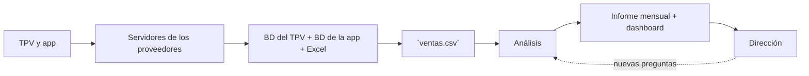

# Café Lumen: ciclo de vida del dato

**Bloque 1 · Sesión 1.1.1** · 06/10/26

## Contexto

Café Lumen es una cadena de cafeterías de especialidad con cuatro locales en Madrid, Barcelona, Valencia y Sevilla. En enero de 2025 lanzó una app de pedidos y fidelización. La dirección nos ha pedido analizar los datos para conocer la evolución del negocio, entender por qué junio fue peor que mayo y comprobar si la app está funcionando.

## Datos recibidos

| Archivo                   | Qué contiene                                                    | Filas |
|---------------------------|-----------------------------------------------------------------|------:|
| `ventas.csv`              | Ventas de las cuatro tiendas y de la app, de enero a junio 2025 | 80874 |
| `tiendas.csv`             | Características de cada uno de los cuatro locales               | 4     |
| `productos.csv`           | Carta de productos, con su precio de venta y coste unitario     | 22    |
| `objetivos_mensuales.csv` | Objetivos de ventas establecidos para cada tienda y mes         | 24    |

## Ciclo de vida

| Fase  | En Café Lumen | Responsable |
|---|---|---|
| 1. Generación | Cada vez que un cliente paga, el TPV registra los productos, cantidades, precio y hora. La app registra además el cliente y, si la deja, su valoración del pedido. | |
| 2. Ingesta | Cada noche, el TPV de cada local envía el cierre del día al servidor central del proveedor del TPV. Los pedidos de la app se encuentran en la nube de otro proveedor. | |
| 3. Almacenamiento | Los datos están repartidos entre la base de datos del TPV, la base de datos de la app y un Excel donde la dirección financiera registra los objetivos mensuales. | |
| 4. Transformación | Se unen las ventas del TPV y de la app en una única tabla utilizando los códigos de tienda y producto. El archivo ventas.csv recibido es el resultado de este proceso. | |
| 5. Análisis | Se analizan los datos para saber qué ocurrió en junio, cómo evoluciona el negocio y qué aporta la app. | |
| 6. Visualización | Los resultados se presentan mediante un informe mensual y posteriormente mediante un dashboard para la dirección. | |
| 7. Decisión | La dirección utiliza los resultados para ajustar horarios, cambiar la carta de verano y decidir si continúa invirtiendo en la app. | |

## Primeras observaciones

- Existen valores vacíos en algunas columnas, como cliente_id y valoracion_ticket.
- El archivo ventas.csv es un extracto de datos y no se actualiza automáticamente si posteriormente se modifica algún registro en los sistemas originales.
- Al tratarse de archivos CSV, los datos se almacenan como texto y será necesario comprobar posteriormente que cada columna se interpreta con el tipo de dato correcto.

## Preguntas para el equipo de sistemas

- ¿Qué significa exactamente que un ticket tenga el estado Anulado?
- ¿Cómo se tratan las ventas anuladas en el importe?
- ¿Las ventas realizadas en tienda física siempre tienen cliente_id vacío o depende de si el cliente está identificado?
- ¿Cómo se calcula el descuento indicado en descuento_pct?
- ¿Los objetivos mensuales se fijaron antes de comenzar cada mes o se pueden modificar posteriormente?
- ¿Cómo se han unido las ventas procedentes del TPV y de la app para generar ventas.csv?
- ¿La información de valoracion_ticket procede exclusivamente de la app?
- ¿Cómo se gestionan las ventas o modificaciones realizadas después de generar el extracto ventas.csv?
- ¿Con qué frecuencia se genera este extracto y qué fecha de corte tiene?
- ¿El importe de las ventas incluye el IVA?
